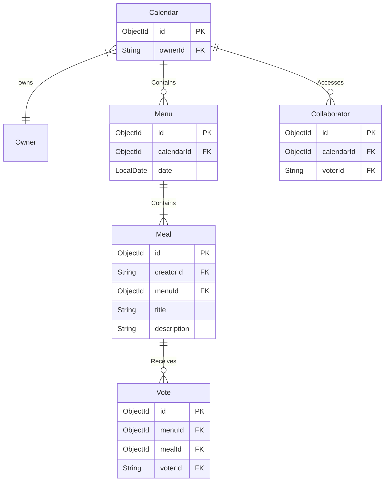

```mermaid
erDiagram
    Calendar }|--|| Owner: owns
    Calendar ||--o{ Menu: Contains
    Calendar ||--o{ Collaborator: Accesses
    Calendar {
        ObjectId id PK
        String ownerId FK
    }
    Menu {
        ObjectId id PK
        ObjectId calendarId FK
        LocalDate date
    }
    Collaborator {
        ObjectId id PK
        ObjectId calendarId FK
        String voterId FK
    }
    Menu ||--|{ Meal: Contains
    Meal ||--o{ Vote: Receives
    Meal {
        ObjectId id PK
        String creatorId FK
        ObjectId menuId FK
        String title
        String description
    }
    Vote {
        ObjectId id PK
        ObjectId menuId FK
        ObjectId mealId FK
        String voterId FK
    }
```